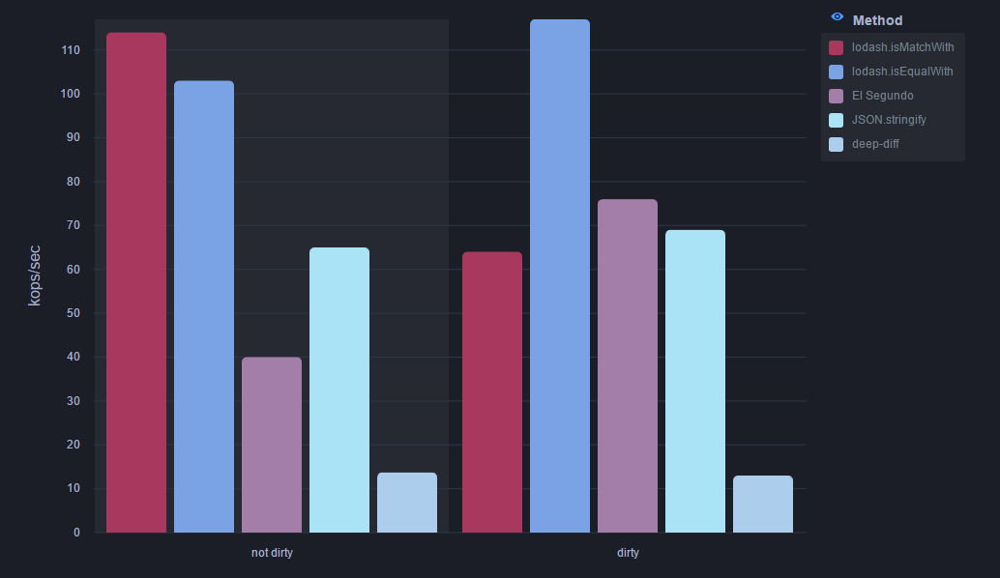

# El Segundo

I don't always do dirty checking, but when I do, I use El Segundo.  The second choice in change detection.

## Background

In JavaScript there is no built-in method to determine if values within an Object (or Array) have changed.  One well known method is to compare the JSON stringified version of an object to a previous value.  For example:

```
const A = {...};

const prevValue = JSON.stringify(A);

... Do some stuff

const isDirty = prevValue === JSON.stringify(A);
```

In fact this may be the fasted method to deep dirty check an object in JavaScript.  However, this approach has a couple of drawbacks:

1) Even if the a value has changed, the `JSON.stringify` method must stringify the entire object under test.  This can be expensive for large and deeply nested objects.
2) `JSON.stringify` does not support circular objects.
2) This method will not detect if a value has been deleted and then the same value added again (i.e. the property key has changed positions).
4) This method only supports value types that have JSON representations.
5) Does not support a way to conditionally ignore portions of objects.  For example properties the begin with `$`.

`El Segundo` is designed to encapsulate this dirty checking process while addressing the issues above.  It does not, and likely never will, be faster than `JSON.stringify` in cases where the object has not changed (i.e. is not dirty), but can realize a notable improvment when the object is dirty.

## Features

1) Efficiently abort dirty checking when a non-equal value is found.
2) Support circular objects.
3) Not impacted by key order changes.
4) Support value types without JSON representations.
5) Conditionally ignore portions of objects.

## Comparison with other methods

| Method          | Early Abort | Circular Objects | Key Order Changes | Non JSON types | Hidden keys    | Maps and Sets  |
|-----------------|-------------|------------------|-------------------|----------------|----------------|----------------|
| El Segundo      | ✓           | ✓                | ✓                 | ✓              | ✓              | ✘              |
| JSON.stringify  | ✘           | ✘                | ✘                 | ✘ <sup>1</sup> | ✓ <sup>1</sup> | ✘ <sup>1</sup> |
| deep-diff       | ✘           | ✓                | ✓                 | ✓              | ✓ <sup>2</sup> | ✘ <sup>2<sup>  |
| lodash          | ✓           | ✓                | ✓                 | ✓              | ✘ <sup>3<sup>  | ✘ <sup>2<sup>  |
| fast-deep-equal | ✓           | ✘ <sup>2</sup>   | ✘                 | ✓              | ✓ <sup>2</sup> | ✓              |

1. Possible using `replacer` parameter... Non JSON types not tested.
2. Possible using prefilter and inspecting the difference results... not tested
3. Keys can be ignored using `lodash.isEqualWith` & `lodash.isMatchWidth`, but neither options supports all cases.



## How to use

```
import { ElSegundo } from 'el-segundo';

const A = {...};

const isDirty = new ElSegundo(A);

// Do some stuff

const isDirty = isDirty.check(A);  // returns true if any value in A has changed
```

## How it works

When an `ElSegundo` object is created it internally stores a map of path-value pairs.  For example, the following object:

```
const leia = {
  role: 'General',
  name: {
    first: 'Leia',
    second: 'Organa'
  },
  siblings: [],
  $hidden: false,
};

const luke = {
  role: 'Jedi',
  name: {
    first: 'Luke',
    second: 'Skywalker'
  }
  siblings: [leia],
  $hidden: true
}

leia.siblings.push(luke);

const isDirty = new ElSegundo(leia);
```

Would store the cached object:

```
{
  '#': 3,
  '#/siblings': 1,
  '#/siblings/0': 3,
  '#/siblings/0/siblings': 1,
  '#/siblings/0/siblings/0': '#',
  '#/siblings/0/name': 2,
  '#/siblings/0/name/second': 'Skywalker',
  '#/siblings/0/name/first': 'Luke',
  '#/siblings/0/role': 'Jedi',
  '#/name': 2,
  '#/name/second': 'Organa',
  '#/name/first': 'Leia',
  '#/role': 'General'
}
```

Later, when the value of `leia` is checked:

```
isDirty.check(leia);
```

The `ElSegundo.protyotype.check` method will test equality (`===`) of each deeply nested value in `leia` to determine if any values have changed.  Once a single value has been detected that fails the equality test, the `check` is aborted with a return value of `true`.  If all values pass the equality tests, and all keys within the cached map have been checked, the `check` will a return value of `false`.

## Credits

`el-segundo` is a [Swimlane](http://swimlane.com) open-source project; we believe in giving back to the open-source community by sharing some of the projects we build for our application. Swimlane is an automated cyber security operations and incident response platform that enables cyber security teams to leverage threat intelligence, speed up incident response and automate security operations.
